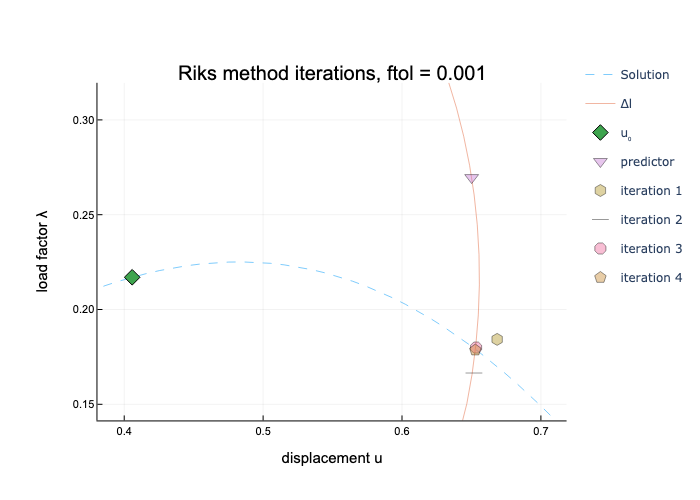

# ArcLengthMethods.jl

Methods available: 
- Riks method
- Crisfields method
- Ramms method
- Modified Crisfield Ramm (MCR) method

## Visualization of iterations

Simple example of two beams with geometric nonlinearity, single degree of freedom.

