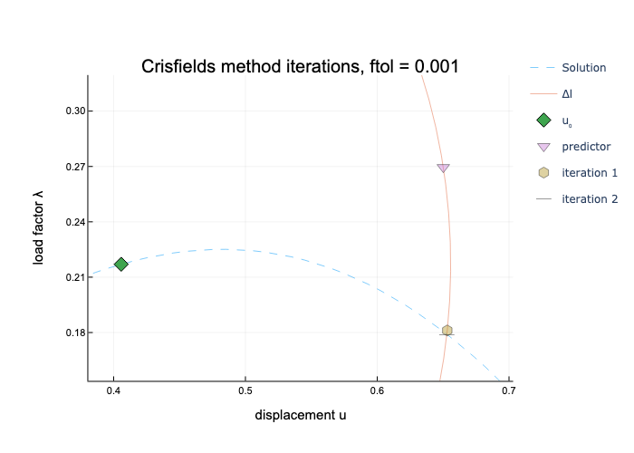
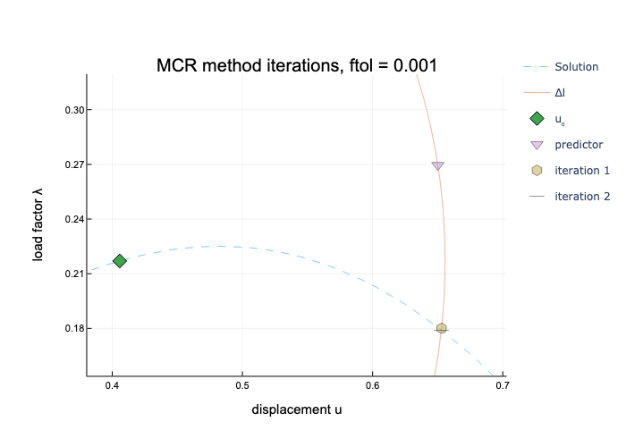

# ArcLengthMethods.jl

## Arc length methods

### Riks method

Equivalent to linearized system, which was parametrized by $\lambda$. Iterations converge to the solution including the satisfaction of arc length condition.

This method is selected with: `method = :riks`.

### Crisfield's method

Quadratic equation is solved for every iteration, hence two solutions are provided, but only the more aligned with predictor direction is employed. Occasionally, imaginary root can appear and arc length parameter $\Delta l$ has to be reduced.

Every increment fulfill the arc length condition. 

This method is selected with: `method = :crisfield` and is selected by default.

### Ramm method

The iterations are on orthogonal hyperplane to the predictor direction, thus do not meet the arc length condition.

This method is selected with: `method = :ramm`.

### Modified Crisfield Ramm method

Similar to Ramm method, but after every iteration, the increment is normalized to fulfill the arc length condition.

This method is selected with: `method = :mcr`.

## Visualization of iterations

Simple example of two beams with geometric nonlinearity with single degree of freedom was evaluated.

